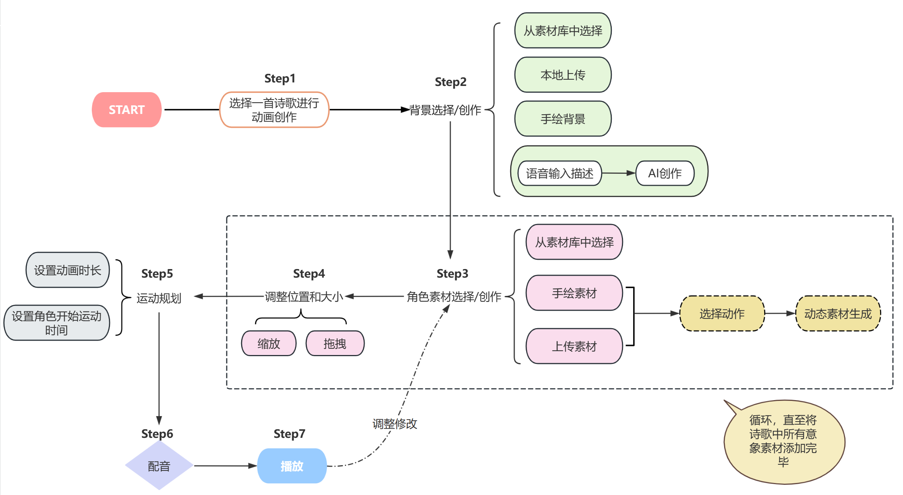
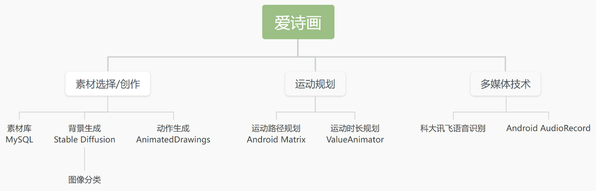

## 技术文档

### 简介

基于**儿童对于动画的热爱**和**现有创作动画技术专业性较高、不适于儿童**的局限，以及**儿童学习、背诵、理解古诗词的需求**，本项目提出设计并实现一款**人工智能赋能的儿童古诗词动画创作App**——“爱诗画”（曾用名为“诗画天地”），简化动画创作难度，允许儿童自己进行针对古诗词的动画创作，利用儿童对动画的热情来激发其对于古诗词的热情，增强学习古诗过程中的参与感和体验感，同时加深其对古诗词的记忆和理解，促进中华**优秀传统文化的传承与延续**。

### 安装和配置

系统要求：Android手机（系统为Android 10以上）

具体方法为：安装apk格式的安装包（在代码中release包下），也可在Android Studio中使用模拟机或真机运行，并允许所需要的录音等权限。

### 开发环境

硬件：联想拯救者R9000P IRX8，16GB内存，1TB SSD

操作系统：Window 11 2022.3.1

软件：Android Studio 

### 使用流程

选择诗歌->选择或上传背景/AI生成背景->选择或手绘意象素材/上传手绘图生成动作->规划运动路径->配音->生成动画

App功能流程图：

### 代码结构
-main
 -java
  -com.example.poemheavenjava
   -entity 实体类包
     -ItemMove 一个角色形象或素材根据其路径运动的辅助类 
     -AnimatedDrawingResponse 使用AnimatedDrawing生成动作的返回相应封装类
     -BackgroundImg 背景素材类
     -Item 动画中的角色形象类
     -Poem 诗歌类
   -utils 工具包
    -AsyncAnimationRequest 异步请求Magic Animation模型用于动作生成类（因效果不佳已弃用）
    -DBOpenHelper 数据库连接类（目前未使用）
    -DimenUtils 长度单位转换类
    -DrawableTool 图片存储方式转换类
    -PcmToWavUtil 声音存储方式转换类
    -ScaleGestureDetectorApi27 页面手势探测类，用于素材（角色形象）选择界面规划每个素材的位置大小
    -TimeUtil 动画时间存储辅助类
    -ToastUtil 提示框辅助类
    -TouchGestureDetector 用于素材（角色形象）选择界面规划每个素材的位置大小的辅助类
    -XunFeiCallbackListener 科大讯飞语音识别返回结果监听接口
    -XunFeiUtil 科大讯飞语音识别调用配置类
   -views 自定义View包
    -BackgroundView 自定义动画背景View
    -DrawingBoardView 手绘白板View
    -SimpleDoodleView 简单涂鸦View，用于指绘运动路径
   -AIBackgroundActivity AI生成动画背景界面逻辑的Activity
   -AnimatedDrawingActivity 使用AnimatedDrawing生成动作的界面逻辑的Activity
   -AnimationRequestActivity 使用Magic Animation模型生成动作的界面逻辑的Activity（因效果不佳已弃用）
   -BackgroOptionSelectActivity 选择如何得到动画背景（素材库或AI生成或手绘或上传）的界面逻辑的Activity
   -BackgroundSelectActivity 素材库选择或手绘或上传动画背景的界面逻辑的Activity
   -DrawingActivity 手绘背景/素材的界面逻辑的Activity
   -DubActivity 配音的界面逻辑的Activity
   -ItemSelectActivity 选择素材+指绘运动路径的界面逻辑的Activity
   -MainActivity 主界面逻辑的Activity
   -MyApplication 存储全局配置的类
   -PoemSelectActivity 诗歌选择界面逻辑的Activity
   -SetActionTimeActivity 规划动画总时长、每个角色运动时间的界面逻辑的Activity
 -python
  -w2pf.py 调用Stable Diffusion XL模型用于动画生成的python文件
 -res
  -layout 所有静态界面XML文件的包

### 关键技术

项目整体使用Android技术实现，辅以语音识别、图像生成、动作迁移、图像分割等人工智能技术，构成了古诗词动画作品创作的完整技术路径。具体技术路径图：

1. **基于Stable Diffusion XL模型的背景生成技术**：

   项目定义了一个背景生成方法：允许儿童语音输入自己希望得到的背景描述，对儿童输入的文本进行二次加工，添加部分关键prompt，如“水墨画风格”、“风景画”、“生动”等，之后调用Stable Diffusion XL模型进行生成，生成后利用图像分类模型对生成的图进行二次检查，判断其是否能够用于后续的动画制作。

   Stable Diffusion XL模型是一个基于深度学习的文本到图像生成模型，专注于将文本描述转换为逼真的图像内容。其独特之处在于利用了扩散过程和长依赖结构，能够更准确地捕捉文本描述中的细微特征，并将其转化为视觉上令人满意的图像表现。

   为了允许儿童输出自己的理解，在简化创作难度的同时保证美观性，项目调用了Stable Diffusion XL模型，用于 AI文字生成图像，以此来生成古诗词动画的背景素材。使用时，儿童使用语音说出或文字输入自己对于古诗词背景的理解或者描述，模型会自动基于描述生成对应的图像。首先我们会将儿童输入的中文翻译成英文，让模型更方便的进行分析，模型会经过文本编码、扩散过程以及条件生成三个过程，最后生成最符合描述的背景图。

   背景生成完成后可能难以符合故事场景的需要，例如，我们希望图上的小路是横向且最好在画面最前方，这可以方便人物、动物的行走。然而在多次试验后，我们发现SD生成的图像大多数是纵深的，这可能与训练数据有关。对于这一问题，我们采取了两种思路解决：一是在SD模型上加上Controlnet对生成的图像进行一定控制，二是训练图像分类模型，根据我们的偏好标准进行分类，判断生成的图像是否符合后续动画的创作使用，若符合，我们将生成的背景图展示给用户，否则重新生成。

2. **基于Magic Animate模型的动作生成技术和基于U2-Net网络、Video2BVH项目、Animated Drawings项目的手绘角色动作重定向技术**

   Magic Animate是一种先进的AI动画生成技术，它结合了深度学习和计算机视觉技术，能够将现实世界中的动作映射到用户提供的人物/动物形象上，并生成高质量的动态素材。

   U2-Net（U-squared Net）是一种用于图像分割任务的深度学习模型，尤其在背景去除和显著性检测任务中表现出色。Video2BVH 是一个开源项目，用于从视频中提取人体姿态并生成BVH（Biovision Hierarchy）格式的文件。BVH是一种广泛使用的骨架动画文件格式，常用于3D动画和运动捕捉数据的存储。Animated Drawings 是由 Meta AI（原 Facebook AI）开发的一个项目，旨在通过将用户手绘的静态图像转换为动画角色。

   项目首先尝试了Magic Animate这一AI动画生成模型，以此来完善素材库中的动态素材，儿童上传自己手绘的或者相机拍摄的人物/动物图片，以及一个期望得到的动作视频，模型自动将该视频中的动作迁移至人物/动物形象上，返回GIF动图，之后我们使用背景去除技术将该GIF动图的背景去除，得到的动图即可作为素材在动画创作平台上使用。

   然而使用效果表明该模型对于儿童手绘形象效果不佳，因此我们改用了指导老师科研课题下已有成果，即基于U2-Net网络和Animated Drawings的手绘角色动作重定向技术，该技术专门适用于儿童手绘画形象的动作生成，首先使用训练好的基于U2-Net网络的形象提取模型提取图片中的手绘形象（自动化），之后使用video2bvh项目提取出视频中的bvh文件、编写脚本修正角度、归一尺寸（半自动），编写AnimatedDrawings项目中的配置文件，最后使用AnimatedDrawings项目进行动作重定向（自动）。

   由于中间配置文件的编写未实现自动化，因此目前并不能实现任意动作的动作生成，而是已有动作的动作生成，当然可以手动添加新动作。

3. **科大讯飞语音识别与Android多媒体技术**

   考虑到打字对于儿童不友好的问题，我们的项目提供了语音输入功能，允许儿童在AI生成背景时说出自己想要的画面，项目利用科大讯飞的语音识别功能将语音实时转化为文字，经过添加水墨风格关键词等的处理后交由AI文生图模型生成背景图。

   项目利用基于Android的多媒体技术，为儿童提供配音、声音与画面融合、同步播放等功能，以增强他们在动画创作过程中的表现力和沉浸感。在配音步骤中，使用Android平台提供的AudioRecord等音频录制API，实现对声音的高质量录制，配音的同时播放动画，使得儿童在配音的同时可以直观地感受到角色的情感和动作。此外，项目利用Android View等技术提供一个直观易用的配音界面，允许儿童在录制声音的同时观看动画画面，以确保他们能够根据角色的表情和动作来进行声音的表达。我们还将支持实时的声音回放功能，让儿童可以立即听到他们的录音效果，并根据需要进行调整和修改。配音完成后，在声音与画面融合方面，同样利用Android多媒体技术实现声音和画面的无缝融合。

### 项目地址

https://gitee.com/lily11111222/aipoem-painting.git
（目前未开源，若需要，请联系2564065295@qq.com）

### 参与贡献
 李丽坤（开发）
 谢卓颖（开发）
 朱荩宜（UI设计）